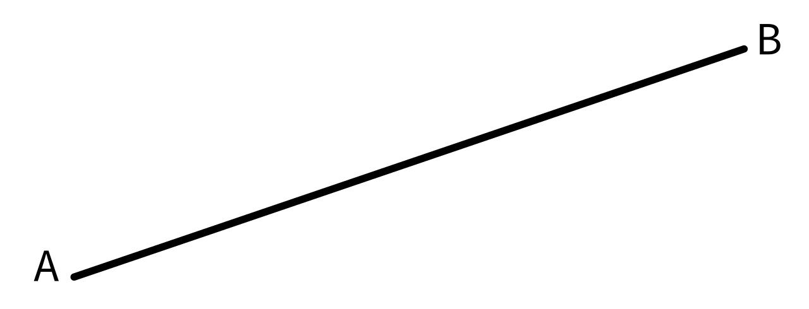
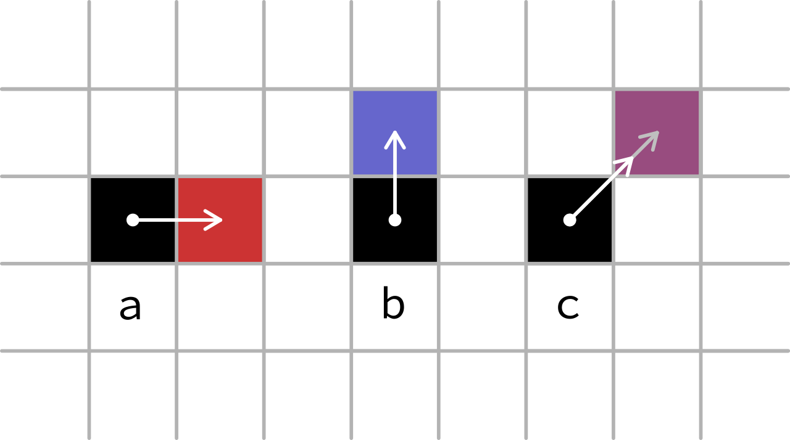
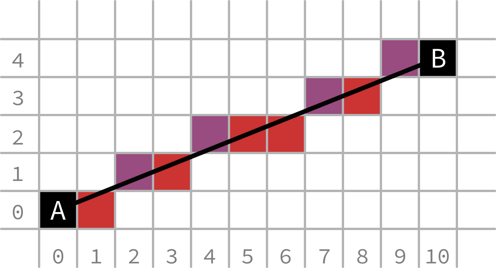
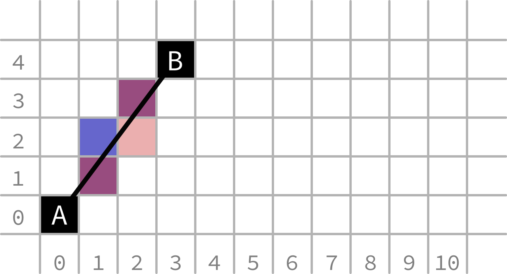
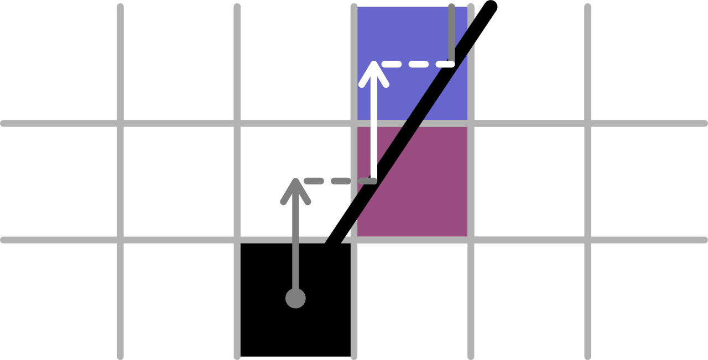
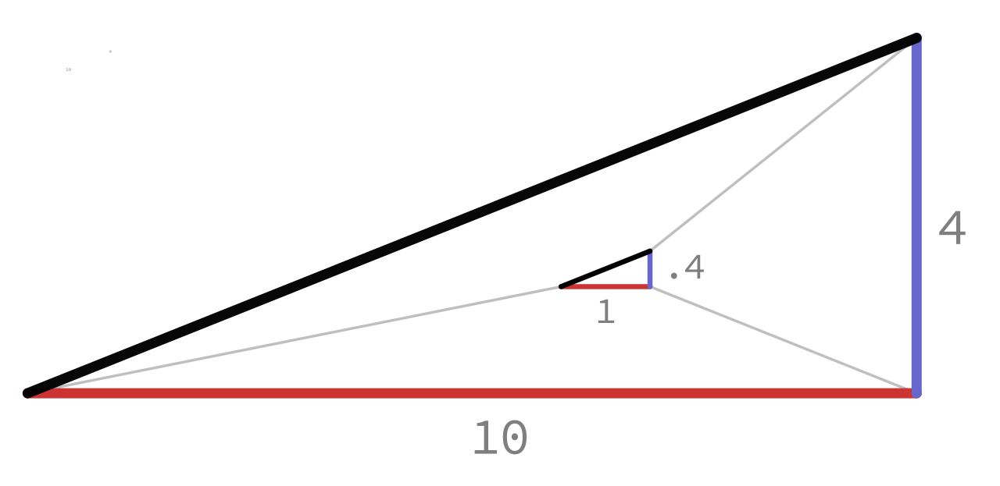

# 02: Line Drawing

This is \(a slightly simplified version of\) how I currently draw my fully aliased \(sic\) lines.

The code was initially written some time after watching Casey's video discussing the issue, so I can't say how much it was influenced by it. I have a feeling there may be some similarity to Bresenham's algorithm, but I haven't looked at it yet. As in large part my current programming practice in general and this project in particular are more focused on improving my skills than quickly achieving results, I've tried to solve problems at least to a functional level myself, before possibly finding a better version from someone else.

If you don't want that opportunity spoiled for yourself I recommend you stop reading here, implement an algorithm for drawing straight lines for yourself, then come back and compare techniques.

All done? Probably not... ah well, read on anyway...

## The Problem

We would like to be able to draw a straight line from any one pixel \(A\) to any other \(B\).  _Figure 1: A straight line from A to B_

The main issue here is that pixels are on a square grid with finite resolution, so from 1 pixel to the next we can only move in 3 types of directions: horizontally \(a\), vertically \(b\) and diagonally at exactly 45° \(c\).  _Figure 2: Pixel directions_

Note that the arrow for \(c\) needs to be longer \(all the white arrows are the same length\). For the same number of pixels drawn, a 45° line will be [√2 times longer](https://en.wikipedia.org/wiki/Square_root_of_2) than the horizontal or vertical line.

## Abstract Solution

\(N.B. I am considering the location of pixels to be their centre, not their bottom-left corner... adapt as appropriate\)

It's clear that we can't get a perfect line at arbitrary angles, so we'll have to approximate.

Assuming we want the line to be contiguous, after the first pixel the next will always be +/-1 horizontally, vertically or both. Ignoring horizontal, vertical and 45° lines for a moment, we can consider lines as predominantly horizontal or predominantly vertical:  _Figure 3: Predominantly horizontal line mapped onto pixel grid_

 _Figure 4: Predominantly vertical line mapped onto pixel grid_

The figures above show potential pixels that adequately fit the black line. They are coloured as in Figure 2 relative to the previous pixel, if moving from A to B.

You can see that an adequate line can be created with the following algorithm: 1. move 1 in the predominant direction 2. intersect the line in the non predominant direction 3. draw the pixel that the intersection is over 4. repeat starting from the intersection for the number of pixels in the predominant direction

Shown visually:  _Figure 5: Basic line algorithm_

Figure 4 shows a minor issue with this: when the intersection falls on the boundary, the line is weighted slightly towards one point \(here the start\). This means that a line drawn A-to-B will be slightly different from a line drawn B-to-A. This is not a huge issue, particularly when using a resolution much higher than 10 x 4, but should be easy to special case \(see the partially transparent pixel\).

It's apparent from Figure 5 that the non-predominant component is both:

* less than the predominant component \(less than 1\)
* constant for a given line

The 2 components and the section of line create a triangle that is similar to the overall line and the x and y difference between A and B. If the overall triangle is scaled so that the predominant component is equal to 1, we will find the length of the non-predominant component \(achieving step 2\). This is equivalent to dividing both components by the longer one.  _Figure 6: Line components from Figure 2 scaled to pixel size_

## Implementation of Solution in C

```c
// 1. Take the buffer to draw in, the 2 points and the colour of the line
/**********************************************************************/

void
DrawLine(image_buffer *Buffer, v2 Point1, v2 Point2, u32 Colour)
{

// 2. Find the largest component of AB and divide both compenents by it
/**********************************************************************/

    v2 Dir = V2Sub(Point2, Point1);    // consider the vector from Point1 to Point2
    v2 AbsDir;                         // may have to compare negatives
    AbsDir.X = Abs(Dir.X);
    AbsDir.Y = Abs(Dir.Y);

    f32 LargestAbsDimension = AbsDir.X;
    if(AbsDir.Y > AbsDir.X)
    {
        LargestAbsDimension = AbsDir.Y;
    }


    v2 SignedDirFraction;
    if(Result.LargestAbsDimension != 0)    // don't divide by 0
    {
        SignedDirFraction.X = Dir.X / LargestAbsDimension;
        SignedDirFraction.Y = Dir.Y / LargestAbsDimension;
    }
    else
    {
        return;    // if the longest side is 0, there is nothing to draw
    }


// 3. Starting from the first point, loop for the number of pixels in the longer dimension, 
//    drawing the pixel, then moving on by the hypotenuse of the component triangle.
/*****************************************************************************************/

    v2 PixelPos = Point1;
    u32 LoopCounterEnd = RoundF32ToU32(LargestAbsDimension);
    for(u32 LoopCounter = 0;
        LoopCounter < LoopCounterEnd;
        ++LoopCounter)
    {
        // Turn 2D floating point coordinate to 1D integral coordinate:
        u32 LinearizedPosition = RoundF32ToU32(PixelPos.Y) * Width + RoundF32ToU32(PixelPos.X);
        u32 *Pixel = (u32 *)Buffer->Memory + LinearizedPosition;

        if( (PixelPos.X > 0 && PixelPos.X <= Buffer->Width  - 1 &&    // don't draw outside the screen
             PixelPos.Y > 0 && PixelPos.Y <= Buffer->Height - 1) )
        {
            *Pixel = Colour;    // no partial transparency, just a simple overwrite
        }

        PixelPos = V2Add(PixelPos, SignedDirFraction);
    }
}
```

I've left out the code pertaining to alpha compositing \(in my case blending colours with premultiplied alpha\), as that's beyond the scope of this post. If you're interested, check out [the Wikipedia page](https://en.wikipedia.org/wiki/Alpha_compositing), [Tom Forsyth's](https://tomforsyth1000.github.io/blog.wiki.html#[[Premultiplied%20alpha]]) [blog posts](https://tomforsyth1000.github.io/blog.wiki.html#[[Premultiplied%20alpha%20part%202]]), and/or [Porter & Duff's original paper on PMA](https://keithp.com/~keithp/porterduff/p253-porter.pdf).

## Conclusion

Hopefully this has shown that drawing a basic \(aliased\) straight line is not too difficult, and has provided a bit of intuition as to why the algorithm is the way it is. If there's anything I can clear up, please do say.

Next time I'll be covering circles!

