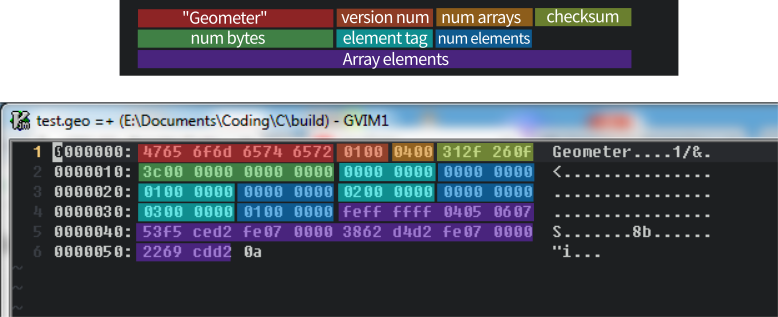

# 03\_fileformat

This is a little out-of-sync, but I've been working on it recently and thought it was worth writing about before I forgot it all.

I didn't want the filetype to be something users would have to think about, so I put a reasonable amount of effort into making the data forward-compatible and the loader backward-compatible.

I have no idea how well the following will relate to text-based file formats.

## Contents

* [Header Format](03_fileformat.md#header-format)
* [Data Array Format](03_fileformat.md#data-array-format)
* [Type Enumeration](03_fileformat.md#type-enumeration)
  * [Basics](03_fileformat.md#basics)
  * [Sizing information](03_fileformat.md#sizing%20information)
  * [Enum Versioning](03_fileformat.md#enum%20versioning)
  * [Type Versioning](03_fileformat.md#type%20versioning)
* [Saving Files](03_fileformat.md#saving%20files)
  * [Checking the byte output](03_fileformat.md#checking%20the%20byte%20output)
* [Opening/Loading Files](03_fileformat.md#opening-loading-files)
* [Conclusions](03_fileformat.md#conclusions)

## Header Format

Most, if not all, binary filetypes begin with a header to provide some metadata about the information to be loaded. There was a bit of back and forth between how the data would be laid out and the header describing it. After some discussion with the lovely folks on the [Handmade Network Discord](https://discord.gg/awz66AN), I decided on some criteria for a file header:

* Distinguish `.geo` filetypes from others \(based on the data as well as the extension\)
* Version the entire filetype, in case any changes have to be made
* Determine how much memory needs to be allocated
* Basic error checking to see if there's any corruption

I ended up with this:

```c
typedef struct file_header
{
    char ID[8];        // unique(ish) text id: "Geometer"
    u16 FormatVersion; // file format version num
    u16 cArrays;       // for data section
    u32 CRC32;         // checksum of data
    u64 cBytes;        // bytes in data section (everything after this point)
} file_header;
```

Note that this has been arranged to fit into 24 bytes with no alignment issues. No padding should be necessary.

## Data Array Format

The type of thing that you want to store will probably have an impact on the format you want to save it in. Basically everything that I need saving is stored in memory as dynamic arrays. \(e.g. `Points`, `Shapes`, `Intersections`...\) Given the length of each array and the size of each element, I can tell how many bytes are needed to store it/read from memory \(when loading\). I also need a way to interpret the type of the elements in an array, from which I can also determine element sizes.

Given this, I lay out each array as follows:

```c
u32 Type;
u32 cElements;
u8  Contents[];
```

I don't currently have to, but given a type that needs more metadata, the contents could very easily start with a type-specific header, then `cElements` would refer to either the number of bytes total or the number of elements after the header.

There's also the occasional single data element that needs adding \(e.g. the basis of the canvas\). You could keep separate sections of the file \(indicated in the header\) for these... Or they can just be treated as arrays of length 1, which keeps everything nice and simple. If I were predominantly saving individual elements for some reason, the waste might add up here and I'd consider a different decision.

## Type Enumeration

### Basics

The type corresponds to an enum tag, which just starts at 0 and is appended to any time a new element type is added. Types are never removed once introduced to a public build as then old numbers would be reused, leading different loaders to interpret the same content in different ways. 4 billion \(and change\) types should be enough to contain all the mistakes I make with the type system. It does require getting over a little perfectionism - having these numbers around that are no longer relevant initially seemed _wrong_, but I think it's the way to go.

You may want an `invalid` type at 0, but it's probably just as useful at `U32_MAX`.

```c
typedef enum section_header {
    HEAD_Points = 0,
    HEAD_Shapes,
    HEAD_Actions,
    HEAD_Basis,
    /* ... */
    HEAD_COUNT,
} section_header
```

### Sizing information

Given that enums start at 0 and add 1 each time, they can be used as array indexes. I've found it useful to keep an array of element sizes, indexed by enum. This is easy to create with an [X-macro](https://en.wikipedia.org/wiki/X_Macro), which relies on deferred macro expansion by the preprocessor:

```c
#define SECTION_HEADERS \
    SECTION_HEADER(HEAD_Points = 0,  v2) \
    SECTION_HEADER(HEAD_Shapes,   shape) \
    SECTION_HEADER(HEAD_Actions, action) \
    SECTION_HEADER(HEAD_Basis,    basis) \
    /* ... */

#define SECTION_HEADER(name, type) name,
typedef enum section_header {
    SECTION_HEADERS
    HEAD_COUNT,
} section_header
#undef SECTION_HEADER

#define SECTION_HEADER(name, type) sizeof(type),
size_t HeaderElSizes[] = { SECTION_HEADERS };
#undef SECTION_HEADER
#undef SECTION_HEADERS
```

### Enum Versioning

As types change, they'll need to be interpreted differently, and so need a different tag. I simply append a version number to the end of each name, and if I need a 'canonical' type, I set an unversioned enum value equal to the current version:

```c
#define SECTION_HEADERS \
    SECTION_HEADER(HEAD_Points_v1 = 0,     v2) \
    SECTION_HEADER(HEAD_Shapes_v1,   shape_v1) \
    SECTION_HEADER(HEAD_Actions_v1, action_v1) \
    SECTION_HEADER(HEAD_Basis_v1,    basis_v1) \
    SECTION_HEADER(HEAD_Actions_v2, action_v2) \
    SECTION_HEADER(HEAD_Basis_v2,    basis_v2) \
    /* ... */

#define SECTION_HEADER(name, type) name,
typedef enum section_header {
    SECTION_HEADERS
    HEAD_COUNT,
    HEAD_Points      = HEAD_Points_v1,
    HEAD_Shapes      = HEAD_Shapes_v1,
    HEAD_Actions     = HEAD_Actions_v2,
    HEAD_Basis       = HEAD_Basis_v2,
} section_header
#undef SECTION_HEADER
```

It's useful to be able to jump back and forth between thinking of the enums as just name tags and as integers.

A coarser-grained alternative here would be to increment the file version in the header with every change. I'm leaving that one for larger, structural changes.

### Type Versioning

As you can see, I've also versioned the types in a way that mirrors the tags. A simple example of this is:

```c
/* geometer_filetype.h */
typedef struct basis_v1 {
    v2 XAxis; /* The magnitude corresponds to zoom */
    v2 Offset;
} basis_v1;

typedef struct basis_v2 {
    v2 XAxis; /* YAxis == Perp(XAxis) */
    v2 Offset;
    f32 Zoom;
} basis_v2;

/* geometer.h */
typedef basis_v2 basis;
```

This canonicalisation keeps any cognitive overhead of thinking of different types local to file loading and saving. You don't want to have to consider all the obsolete formats when writing everyday code. I continue this compartmentalisation by putting all the versioned types into a separate file.

The data attached to each array obviates the need for too much description in the header. It also has the nice feature of not changing size depending on the contents.

The arrays can also come in any order or not be included.

## Saving Files

Saving is easier than loading as you only need to consider the current version. This is another place that I use X-macros, which here are in the following format:

```c
#define DATA_PROCESSES                            \
    DATA_PROCESS(tagtype, numElements, arrayBase) \
    /* ... */
```

They let me automate things that were the source of some bugs before I got my macro game on-point. One came from the `cArrays` value no longer reflecting the actual number of arrays being saved after I added a new datatype. This then meant that the last array wasn't loaded, which tripped the `cBytes` check. It was not immediately obvious that `cArrays` was the culprit, and although it wasn't a particularly bad bug to find, did take longer than necessary. Now I just use `#define DATA_PROCESS(a, b, c) +1` and set `cArrays` equal to `DATA_PROCESSES`. I don't have to worry about forgetting to update this manually again.

Other than that, all the data is sent through the CRC32 calculator \(which can be done with multiple continuations to the function\) and added to `cBytes`. This should include the tag and the count of elements, as these make up part of the save data as well!

### Checking the byte output

I used `xxd` to create a hex view of the data. I then put this in [Inkscape](https://inkscape.org/en/)\(a useful free vector drawing tool\) and colour-coded the different sections to make sure it was doing what was expected.



It's useful to keep in mind that this is what it looks like on disk - there's no other tagging, it's just a series of numbers that you have to make meaningful. If you're unfamilar with looking at hexadecimal:

* 2 characters represent 1 byte.
* The values for a byte range from `00` to `FF` \(255\).
* The bytes are arranged here in [little-endian order](https://en.wikipedia.org/wiki/Endianness) \(least-significant byte first\)

You can see that no unexpected padding has been added. \(It may also be worth using a `#pragma pack` and/or statically asserting `sizeof(file_header) == ExpectedSize`\)

## Opening/Loading Files

There's no room for perfectionism here either: if you want to maintain backwards compatibility you have to keep a trace of all of your past mistakes around, taunting you.

1. Given a file to load, you read the size of the header and make sure that it's the right filetype \(is the ID as expected\)
2. My filetype does allow reading in arrays all at once, but it's easier to just allocate cBytes and load everything all at once.
3. This can then be CRC32'd in one go, getting that out of the way.
4. I then just allocate and load the arrays as you'd expect, and edit any metadata needed.

   ```text
    Loop for cArrays:
        With type determined by the tag given:
            Allocate memory as needed (e.g. for arenas)
            Mark that type as included in the save file
            Loop for cElements of that type:
                Update the element individually to the latest version of that type
                Add the element to the relevant array/arena/individual variable
            Update metadata as needed (e.g. arena length, capacity)
    Apply defaults for data not provided by file (e.g. basis)
    Calculate any variables that are based on the loaded data (e.g. shape intersections)
   ```

There's a count of bytes per array as well as overall. These can be checked together for a bit of redundancy.

I was using at one point X-macros again here, but I found that they're not fine-grained enough for dealing with multiple versions of types.

My main breakthrough here was figuring out a way of avoiding O\(n^2\) code every time the array element types change. The naive thing to do is directly convert all previous types to the current type. Instead, I'm converting each version to the one that follows it, until it is up-to date, somewhat like a conveyor belt \(or Duff's device\)

Here's an example of what that might look like if I decided to notate all points with layers when I added the concept, then later increased the precision from f32 to f64. \(Neither of these are currently the case\). The inner `for` loop is the most important bit, but I thought I'd add the context.

```c
u8 *At = FileContents;
u8 *FinalAt = At + FileHeader.cBytes;
for(uint iArray = 0; iArray < FH.cArrays; ++iArray)
{
    u32 ElType    = *(u32 *)At;    At += sizeof(ElType);
    u32 cElements = *(u32 *)At;    At += sizeof(cElements);
    TypesFoundInFile[ElType] = 1;
    size_t cBytesEl = cElements * HeaderElSizes[ElType];
    void *Elements = (void *)At;
    At += cBytesEl;
    switch(ElType)
    {
        case HEAD_Points_v1:
        case HEAD_Points_v2:
        case HEAD_Points_v3:
        {
            /* NOTE: uses canonical/current type */
            State->Points = AllocateDynamicArray(HeaderElSizes[HEAD_Points], cElements);

            for(u32 iEl = 0; iEl < cElements; ++iEl)
            {
                point_v1 Point_v1 = {0};
                point_v2 Point_v2 = {0};
                point_v3 Point_v3 = {0};

                /* This will be the same every iteration of the loop,
                   so branch prediction should be very effective */
                switch(ElType)
                {
                    case HEAD_Points_v1:
                        Point_v1 = (*(point_v1 *)Elements)[iEl];
                        Point_v2.X = Point_v1.X;
                        Point_v2.Y = Point_v1.Y
                        Point_v2.Layer = 1;
                        /* fallthrough */

                    case HEAD_Points_v2:
                        if(ElType == HEAD_Points_v2) /* only if it jumped straight here */
                        { Point_v2 = (*(point_v2 *)Elements)[iEl]; }
                        Point_v3.X = (f64)Point_v2.X;
                        Point_v3.Y = (f64)Point_v2.Y;
                        Point_v3.Layer = Point_v2.Layer;
                        /* fallthrough */

                    case HEAD_Points_v3:
                        if(ElType == HEAD_Points_v3)
                        { Point_v3 = (*(point_v3 *)Elements)[iEl]; }
                }

                State->Points[iEl] = Point_v3;    /* point is typedef'd to point_v3 */
            }
        } break;

        /* ... other element types ... */

        default:
        {
            MessageBox(WindowHandle, "Unexpected data or corrupted file. Try again.",
                       "Filetype Error", MB_ICONERROR);
            File = 0;
        }
    }
}
```

## Conclusions

Hopefully I've shown that simple binary formats are not too tricky to implement. There are some gotchas along the way, but hopefully this post will help you avoid a few of them if you decide to make one yourself. Versioning in a sane way for both coding and loading seems to be the largest hurdle. I'm not sure how well my solutions will work for other people's scenarios, but perhaps they've at least sparked a few ideas. 

