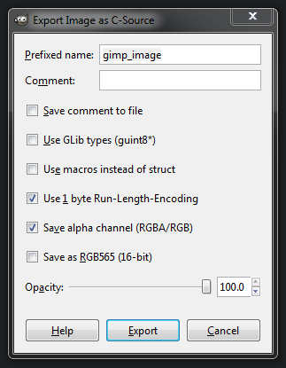
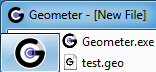

At some point you'll probably want to include some data or resources into the executable itself (e.g. fonts, images etc).
This is particularly true for my case, as I'm trying to keep to a portable single-executable model.
That means that I can't keep resources in a surrounding folder and load at runtime, and I don't want to assume that the user already happens to have the files on their system.

Icons are one example of a useful resource that takes an application from looking amateurish to looking like a Real Product (tm).

This post will show some cross-platform methods of adding resources to your application, and a Windows-only method, with icons as an example.

# Contents

- Intro
- Compiled resources (platform-independent)
	- xxd
	- GIMP
- Linking (Windows-specific)
	- Linking icons as resources
		- RC file text
		- RC to RES
		- Linking the RES to your executable
		- Resource access from code
		- Using icons
- Concluding thoughts

# Intro
You can divide methods of including resources in your application into 3 groups based on when they are attached, each with an analogous form for adding libraries:

- Runtime [.dll/.so files] - loaded with `fopen` and that family of functions.
I won't be going into this here as there are tutorials for them all over the internet and it's not relevant to my use case.
- Linked [.lib/.a files] - processed and added by the linker, these have to be 'found' in the executable at runtime.
- Compiled [files added with `#include`] - added to source code, commonly as an array of bytes in a header.

Inherent in linking resources to your executable is that it will get larger.
The resources that I'm using in an editor are few and small, and as such, the pros of portability and simplicity win out.
If you're making a game with large textures and audio files, the trade-off may not be so appealing.

The ease of modding resources in a folder layout is also something that might be more appreciated for a game.

# Compiled resources (platform-independent)
Adding resources via an array in a header file is the simplest in terms of runtime use: they can be accessed like any normal variable/array.
As such, this is my preferred method unless there are major reasons to go a different way.

## xxd
`xxd` is a command-line utility for interacting with binary files, primarily converting to and from hex data.
It's normally a unix application, but it also comes bundled with the Windows version of [`Vim`](https://www.vim.org/download.php), which is handy for me...
(You can access it directly through Vim with `:!xxd ...` or find it in the application's folder.) 

The default output of xxd is what you see in a hex viewer, and is actually what I was using in [my last blog post](https://geometer.handmade.network/blogs/p/3077-03._designing,_saving_and_loading_a_forward-compatible_binary_file_format) to validate my file format:

	xxd test.geo


Hey, this is just a bunch of hexadecimal numbers; you can format numbers like this in normal C code by slapping "0x" at the front:

	char Fifteen = 0x0F;

Why not just make an array of these and add them to the code?

Helpfully for our purposes, xxd has an option to format its output for an include file:

	xxd -i test.geo test_geo.h

My `test.geo` file has changed since the hex dump image above, but here's a look at the current version.

``` c
/* test_geo.h */
unsigned char test_geo[] = {
    0x47, 0x65, 0x6f, 0x6d, 0x65, 0x74, 0x65, 0x72, 0x01, 0x00, 0x06, 0x00,
    0x49, 0xd9, 0x86, 0x56, 0x8b, 0x01, 0x00, 0x00, 0x00, 0x00, 0x00, 0x00,
    0x00, 0x00, 0x00, 0x00, 0x03, 0x00, 0x00, 0x00, 0xce, 0xcc, 0xec, 0xc0,
    0x04, 0x00, 0x00, 0xc0, 0x66, 0x35, 0xec, 0x40, 0xbb, 0x6d, 0x6e, 0xc1,
    0xdc, 0x4c, 0xc0, 0xc1, 0xe2, 0x62, 0x46, 0xc1, 0x01, 0x00, 0x00, 0x00,
    0x03, 0x00, 0x00, 0x00, 0x09, 0x21, 0x21, 0x02, 0x00, 0x00, 0x00, 0x01,
    0x00, 0x00, 0x00, 0x05, 0x00, 0x00, 0x00, 0x01, 0x00, 0x00, 0x00, 0x02,
    0x00, 0x00, 0x00, 0x03, 0x00, 0x00, 0x00, 0x03, 0x00, 0x00, 0x00, 0x09,
    0x00, 0x00, 0x00, 0xfa, 0xff, 0xff, 0xff, 0x01, 0x00, 0x00, 0x00, 0x00,
    0x00, 0x00, 0x00, 0xcd, 0xcc, 0x80, 0xc1, 0xcd, 0xcc, 0x4c, 0x3e, 0xfa,
    0xff, 0xff, 0xff, 0x02, 0x00, 0x00, 0x00, 0x00, 0x00, 0x00, 0x00, 0x00,
    0x22, 0x84, 0xbf, 0xb4, 0x39, 0x4f, 0xc1, 0xfa, 0xff, 0xff, 0xff, 0x03,
    0x00, 0x00, 0x00, 0x00, 0x00, 0x00, 0x00, 0xf0, 0xb3, 0x3c, 0x40, 0xdb,
    0x74, 0xc9, 0x40, 0x05, 0x00, 0x00, 0x00, 0x01, 0x00, 0x00, 0x00, 0x01,
    0x00, 0x00, 0x00, 0x02, 0x00, 0x00, 0x00, 0x03, 0x00, 0x00, 0x00, 0x0a,
    0x00, 0x00, 0x00, 0xc0, 0xcc, 0xcc, 0x3e, 0x67, 0x66, 0x06, 0x41, 0x01,
    0x00, 0x00, 0x00, 0x02, 0x00, 0x00, 0x00, 0x0a, 0x00, 0x00, 0x00, 0xcd,
    0xcc, 0x04, 0x41, 0x01, 0x00, 0x28, 0xc1, 0x01, 0x00, 0x00, 0x00, 0x02,
    0x00, 0x00, 0x00, 0x0a, 0x00, 0x00, 0x00, 0x00, 0x00, 0x00, 0x00, 0x00,
    0xcd, 0xcc, 0xbd, 0x01, 0x00, 0x00, 0x00, 0x02, 0x00, 0x00, 0x00, 0x0a,
    0x00, 0x00, 0x00, 0x34, 0x33, 0xaf, 0xc1, 0x66, 0x66, 0xf6, 0xc0, 0x03,
    0x00, 0x00, 0x00, 0x00, 0x00, 0x00, 0x00, 0x0a, 0x00, 0x00, 0x00, 0x9a,
    0x99, 0x31, 0xc1, 0x34, 0x33, 0x63, 0xc1, 0x03, 0x00, 0x00, 0x00, 0x00,
    0x00, 0x00, 0x00, 0x05, 0x00, 0x00, 0x00, 0x1a, 0x00, 0x00, 0x00, 0x00,
    0x00, 0x00, 0x00, 0x00, 0x00, 0x00, 0x00, 0x00, 0x00, 0x00, 0x00, 0x00,
    0x00, 0x00, 0x00, 0x00, 0x00, 0x00, 0x00, 0x00, 0x00, 0x00, 0x00, 0x00,
    0x00, 0x00, 0x00, 0x00, 0x00, 0x00, 0x00, 0x00, 0x00, 0x00, 0x00, 0x00,
    0x00, 0x00, 0x00, 0x00, 0x00, 0x00, 0x00, 0x00, 0x00, 0x00, 0x00, 0x00,
    0x00, 0x00, 0x00, 0x00, 0x00, 0x00, 0x00, 0x00, 0x00, 0x00, 0x00, 0x00,
    0x00, 0x00, 0x00, 0x00, 0x00, 0x00, 0x00, 0x00, 0x00, 0x00, 0x00, 0x00,
    0x00, 0xa0, 0x41, 0x00, 0x00, 0x00, 0x00, 0x00, 0x00, 0x00, 0x00, 0x00,
    0x00, 0x00, 0x00, 0x00, 0x00, 0x00, 0x00, 0x00, 0x00, 0x00, 0x00, 0x00,
    0x00, 0x00, 0x00, 0x00, 0x00, 0x00, 0x00, 0x04, 0x00, 0x00, 0x00, 0x01,
    0x00, 0x00, 0x00, 0x00, 0x00, 0x80, 0x3f, 0x00, 0x00, 0x00, 0x00, 0x00,
    0x00, 0x00, 0x00, 0x00, 0x00, 0x00, 0x00, 0xcd, 0xcc, 0xcc, 0x3d
};
unsigned int test_geo_len = 419;
```

An array and a count of bytes - what more could you ask for!

Note that the size on disc of your h file will be about 6 times larger than the file you're including - you're using 6 bytes to encode a single one: "0x47, ".
I tend to search and replace to remove the spaces, making it about 5x the orginal filesize.
This shouldn't be a problem unless you're really strapped for space on your development machine.
It won't affect the executable size.

I currently do this with a font.
In one of my earlier releases I forgot that I was loading the font from disc at runtime, so the first feedback I got was that it was crashing on opening... not great!

You can also do some compression to save space in the executable.
You then just need a [way to decompress at runtime](https://github.com/richgel999/miniz).

If you change the data contents of your files frequently, they can be converted to C headers as part of your build process (before you compile).

If you don't want to get xxd for whatever reason, there are [alternatives out there](https://stackoverflow.com/questions/1710376/convert-files-of-any-types-to-a-file-with-c-strings),
or you can make your own, which you can do pretty quickly.

## GIMP
_(Examples are from GIMP 2.8)_

While xxd outputs generic bytes from any old file type, if you want to easily include some images, [GIMP](https://www.gimp.org/) has a nice feature where it will let you export C source code/headers in RGB(A).
This is the basic format:

``` c
static const struct {
    unsigned int  width;
    unsigned int  height;
    unsigned int  bytes_per_pixel; /* 2:RGB16, 3:RGB, 4:RGBA */ 
    unsigned char pixel_data[700 * 400 * 4 + 1];
} gimp_image = {
    700, 400, 4,
    "\0\0\0\0\0\0\0\0\0\0\0\0\0\0\0\0\0\0\0\0\0\0\0\0\0\0\0\0\0\0\0\0\0\0\0\0"
    "\0\0\0\0\0\0\0\0\0\0\0\0\0\0\0\0\0\0\0\0\0\0\0\0\0\0\0\0\0\0\0\0\0\0\0\0"
    /* ... */
};
```

_(Note the more compact string-based encoding.)_



There are quite a few options, including basic run-length encoding, which dramatically decreases the size of images with blocks of colour.
This also includes a macro for reading the RLE data.

You can trade off a significant reduction in executable size with a slightly easier file to read.
Have a play around with the various settings and see what you get.


# Linking (Windows-specific)
The other option we're exploring here is for the linker to bundle the file into the executable.
Once it's there, we need a way to find it at runtime.
On Windows, this is done using the ['Resource' API/system](https://msdn.microsoft.com/en-us/library/windows/desktop/ms648008.aspx).
The simplified process for this is:

1. Notate the files you want included in a .rc text file
2. 'Compile' the .rc file to a .res file
3. Link the .res file in with your program
4. Access the resource data in your code
5. Use the data

I'll work through this with icons as an example.
It seems as though you have to include icons with this method to get them to show up everywhere you want.

## Linking icons as resources
I'll assume here that you have an icon.
If not, you can create and export .ico files with GIMP.

### RC file text

These have a pretty simple format: the name of the resource (as you'll access it in the code), the type, and the relative file location.

``` rc
Icon       ICON "G_32.ico"
IconSmall  ICON "G_16.ico"
```

There are a number of types, including a generic/custom data format.

### RC to RES
This just involves running the `rc` executable on the RC file.
(The nologo flag just stops it from spitting out copyright information).

    rc -nologo geometer.rc

This outputs `geometer.res`.
If you're doing this from the command line then as with `cl`, you have to run the `vcvarsall.bat` in the shell before you run `rc`:

    call "C:\Program Files (x86)\Microsoft Visual Studio 14.0\VC\vcvarsall.bat" x64

### Linking the RES to your executable
This is just linked as you would a static library:

    cl ...flags... win32_geometer.c /link ...libs... geometer.res

### Resource access from code

Typical resources are accessed with [`FindResource`](https://msdn.microsoft.com/en-us/library/windows/desktop/ms648042.aspx) and [`LoadResource`](https://msdn.microsoft.com/en-us/library/windows/desktop/ms648046.aspx).
Some of these can be accessed more succinctly, e.g. `LoadCursor` and `LoadIcon`.

### Using icons
Just having the icon resource attached adds the icon to the executable and associated files in Windows Explorer/My Computer.



Adding the icons to the top-left of the program window and the taskbar is easy if you're loading the window class yourself:

``` c
WNDCLASSEX WindowClass    = {0};
WindowClass.cbSize        = sizeof(WNDCLASSEX);
WindowClass.style         = CS_HREDRAW | CS_VREDRAW;
WindowClass.lpfnWndProc   = Win32MainWindowCallback;
WindowClass.hInstance     = Instance;
WindowClass.hCursor       = LoadCursor(0, IDC_ARROW);

WindowClass.hIcon         = LoadIcon(Instance, "Icon");
WindowClass.hIconSm       = LoadIcon(Instance, "IconSmall");

WindowClass.lpszClassName = "BasicWindowClass";
```

# Concluding thoughts
I've shown how I include data in my executables on Windows and with a platform-independent method.
I default to using the platform-independent method unless there's a good reason to use something else (like the special treatment icons get as 'Resources').
Other people I know just put everything in the resource files as they're only/primarily targeting Windows, and the RC files keeps everything in one place.
There doesn't seem to be much difference in speed at compile- or run-time.

Please do let me know if you attach files to your executable with these methods or if you have any related tips to share.
