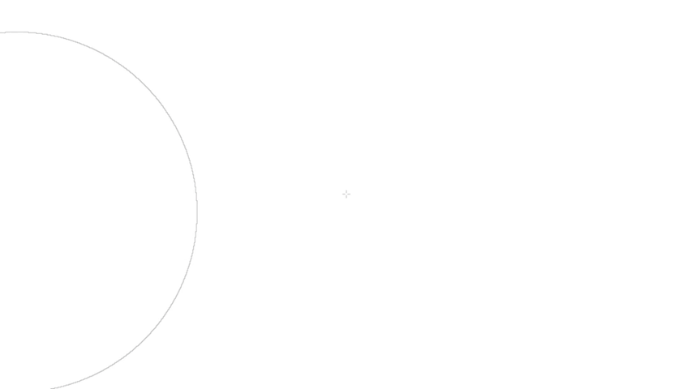

*A simple drawing program to replicate construction with a compass and straightedge.*

This project is under development, nothing is final. These are notes I've made for myself.
By using any executables herein, you understand it is in an unfinished state, and may break your computer or eat your cat.

[Download working prototype here](https://github.com/azmr/geometer/releases/latest)

# Contents
- [Current UI](#current-ui)
	- [Drawing](#drawing)
		- [Arcs (compass)](#arcs-compass)
		- [Segments/lines (straight-edge)](#segmentslines-straight-edge)
	- [Selection](#selection)
	- [Modifiers](#modifiers)
	- [Canvas/view manipulation](#canvasview-manipulation)
	- [Length/radius manipulation](#lengthradius-manipulation)
	- [File manipulation](#file-manipulation)
- [Project background](#project-background)
- [Goals](#goals)
	- [Functional goals](#functional-goals)
	- [Technical goals](#technical-goals)
	- [Project goals](#project-goals)
- [Roadmap](#roadmap)
	- [DONE](#done)
	- [TO DO](#to-do)

# Current UI
## Drawing
- `LMB-drag` - set length/radius
- `Alt-LMB`  - quick draw point
	- `-drag` - quick draw segment
- `Alt+drawing input`   - only draw points, not shapes
- `LMB`      - start drawing a shape:

### Arcs (compass)
- `LMB`      - circle
- `LMB-drag` - arc

### Segments/lines (straight-edge)
- `RMB`      - line
- `RMB-drag` - extend line
	- `-from the initial point` - set perpendicular

## Selection
- `RMB`       - add point(s) to selection
	- `drag`     - box select
- `Alt+^^^`   - remove point(s) from selection
- `Delete`    - delete selected points (+shapes)
- `Ctrl+A`    - select all on current layer

## Modifiers
- `Esc`      - cancel
- `Ctrl`     - snap to shapes
- `Shift`    - no snapping (by default the cursor will snap to points and intersections)
- `Alt`      - general modifier (number store...)
- `Space`    - canvas modifier (pan, basis)

## Canvas/view manipulation
- `MMB-drag`       - pan viewport around canvas
- `Arrow keys`     - pan viewport around canvas
- `Space+LMB-drag` - pan viewport around canvas
- `Space+RMB-drag` - set horizontal (right-facing) axis of viewport (rotate the canvas)
- `Scroll`         - zoom to cursor
- `PgUp/PgDn`      - zoom to centre
- `Home`           - return to starting point
- `Backspace`      - reset canvas drawing
- `Alt+Enter`      - toggle fullscreen
- `Ctrl+Tab`       - up a layer
- `Ctrl+Shift+Tab` - down a layer
- `Ctrl+T`         - toggle layer thumbnails (likely to change soon)

## Length/radius manipulation
- `2-0`      - divide length by 2-10
- `Alt+2-0`  - multiply length by 2-10
- `a-z,A-Z`  - get stored length/radius
- `Alt+a-Z`  - set stored length/radius
- `Tab`      - swap to previously used length

## File manipulation
- `Ctrl+Z`    - undo
- `Ctrl+Y`    - redo
- `Ctrl+Sh+Z` - redo
- `Ctrl+S`    - save file
- `Ctrl+Sh+S` - save file as...
- `Ctrl+O`    - open file
- `Ctrl+Sh+O` - open file in new window
- `Ctrl+N`    - new file
- `Ctrl+Sh+N` - new file in new window

## Misc
My input handling is not yet dialled in.
Sometimes it seems as though keys are 'stuck' down.
If you press and release the key again, this sorts out the issue.
For example, if you `Alt + Tab` into/out of the program it thinks `Alt` is held down, so the canvas may rotate when you mean to draw lines.

# Project background
Learning some woodworking a few months ago, I got into some design using a compass and straightedge. The tools required for this are very simple, and as such have been around for thousands of years, used for physical design from fine cabinet-making to large-scale architecture. Despite their simplicity, combinations of arcs and straight lines allow for a very powerful method for design and encourage in the designer an understanding of proportion and rhythms.

I was impressed when I came across https://sciencevsmagic.net/geo/ a little while ago, and after gaining a better understanding of the fundamentals of compass/straightedge construction with By Hound and Eye (Geo Walker and Jim Tolpin), I decided I should try to make a more complete desktop application to emulate this geometrical method of construction.

# Goals
This is the first 'proper' desktop application I have attempted to build, so I'm likely to have overlooked some key/time-consuming features.
With that said, these are the main goals for the project:

## Functional goals
- UI that emphasises drawing ease and speed with minimal input (primarily mouse-based)
- Draw points, circles, arcs and lines
- Drawing between intersections (and along lines) maintained as a central concept as with manual construction
- Scalable, movable, rotatable canvas
- Multiple layers
- Export drawings in useful formats (.svg, .png...)

## Technical goals
- Ability to create 'large' (more precise size TBD) drawings without slowdown
- Programmed in C with minimal library usage (e.g. drawing functions all created 'by hand')
- Support Windows from the start, probably support Linux and Mac OS as well

## Project goals
- Write [blog entries](https://geometer.handmade.network/blog) describing/explaining the design and implementation of major features (being fairly new to this, these will probably focus on overcoming the various problems I encounter along the way).
- Provide access to most, if not all, source code (all the project-specific stuff is currently on GitHub).
- Provide at least the basic program free. I haven't decided whether a paid, 'advanced' version would be appropriate.
- Target user personas: woodworker designing furniture, mathematician demonstrating various geometric constructions.

There are also a number of other ideas that I've been playing around with, but haven't yet decided upon whether they are worth including in the project. I'm sure these will be the topic of future blog posts.

# Roadmap
In roughly implementation order:

## DONE
- Draw lines
- Draw circles
- Index circles & lines on points
- Snap to points (optional but on by default)
- Line-line intersection
- Line-circle intersection
- Circle-circle intersection
- Delete points
- Move points
- Undo function
- Draw and intersect arcs
- Panning
- Zooming and rotation
- Animate between changes in basis
- Unlimited points/shapes
- File saves/loading
- Faster way to implement multiple arcs/circles of the same radius
- Add layers and decide on how they can interact

## TO DO
- Basic .png exports
- Add text labels for points
- Improved exports
- Improve graphical representation (anti-aliasing, experiment with sweeps when moving the mouse quickly...)
- Consider hardware rasterizer
- Decide on and use a spatial partitioning method
- More advanced undo system?
- Rays and/or lines
- New and exciting features... (parametric editing? animation between states?! Who knows? Only time will tell...)
