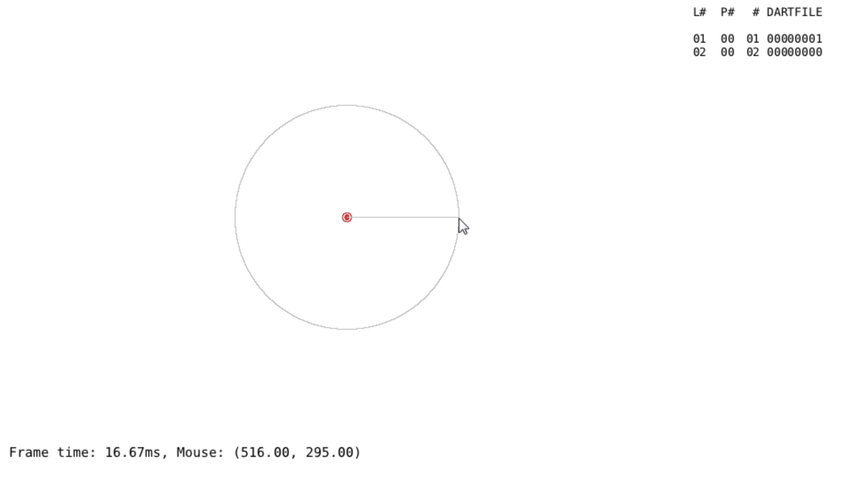

# Geometer

*A simple drawing program to replicate construction with a compass and straightedge.*

This project is under development, nothing is final. These are notes I've made for myself.
By using any executables herein, you understand it is in an unfinished state, and may break your computer or eat your cat.

[Download working prototype here](https://github.com/azmr/geometer/releases)

## Intended UI (partially implemented):

Click on point to select it OR make new point (which is then selected)
L-click on another point to draw to it, or L-click and drag to set direction at point, then release to set drag length
OR R-click to draw circle at current diameter, or R-click and drag to set arc beginning and release at arc end

Esc to cancel point
Enter to leave lone point
Text to add comment/label

shift unlocks diameter, caps toggles it
set diameter with R-clicks when no point selected

M-click/Space+L-click + drag -> move canvas
Scroll -> move up/down or zoom?

## TODO:

- Find (and colour) lines intersecting at a given point
- Bases and canvas movement
- Arcs (not just full circles
- Undo states
- Change storage of intersections, so they don't all need to be recomputed on changes
- Spatially partition(?) shapes
- Set lengths on other lines (modulus?)
- Togglable layers
